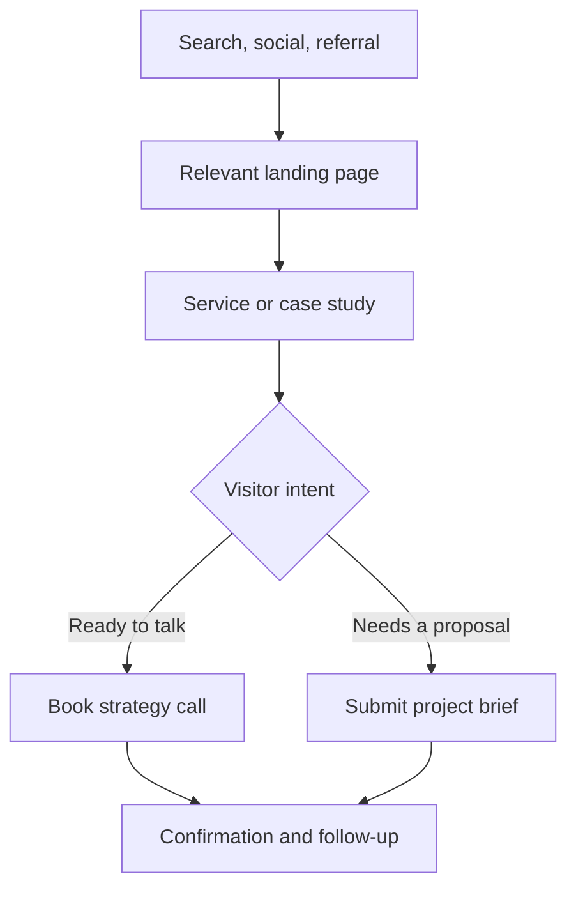

# Kreative Sparq Website Implementation Plan

**Domain:** [kreativesparq.com](https://kreativesparq.com)  
**Repository:** [github.com/techilounge/Kreative-Sparq](https://github.com/techilounge/Kreative-Sparq)  
**Hosting:** Vercel  
**Status assumption:** The GitHub repository is private or newly created, Vercel is connected to it, and no production deployment has been created yet.

## 1. Project outcome

Build a fast, polished marketing-agency website that does four jobs well:

1. Explain what Kreative Sparq does without overwhelming visitors.
2. Establish trust through real work, measurable outcomes, process, and people.
3. Convert qualified visitors into booked strategy calls or project inquiries.
4. Build an SEO foundation that can grow through service pages, case studies, and useful articles.

The site should feel editorial and premium rather than decorative or template-driven. Motion should support hierarchy and feedback, not distract from the work. Every major page should lead naturally to a service, a case study, a booking action, or a project inquiry.

## 2. Brand direction

### 2.1 Visual character

- Confident, warm, sharp, and modern.
- Editorial serif typography for high-impact headlines.
- Clean sans-serif typography for navigation, body text, forms, and utility content.
- Generous whitespace and an asymmetric grid.
- Large, art-directed photography with real people, environments, and client work.
- Restrained use of rounded corners. Avoid turning every section into a card.
- No generic neon gradients, glass panels, floating blobs, random 3D objects, or stock “marketing dashboard” graphics.

### 2.2 Brand color tokens

The values below are practical approximations extracted from the supplied logo and extended into a deliberate light-and-dark theme. Confirm the logo colors against the final source artwork before locking the design system.

#### Core brand colors

| Token | Value | Primary use |
|---|---:|---|
| Forest | `#2A371B` | Light-mode headlines, navigation, brand fields |
| Deep Forest | `#152011` | High-contrast details and selected dark surfaces |
| Terracotta | `#CE5129` | Brand accents, large display text, visual highlights |
| Burnt Terracotta | `#A63B1C` | Light-mode buttons with white labels |
| Charcoal | `#242424` | Light-mode body text and UI labels |
| Soft Sage | `#D8DEC9` | Secondary panels and subtle dividers |

#### Light-mode tokens

| Token | Value | Primary use |
|---|---:|---|
| Mineral White | `#F2F4F0` | Main light-mode background |
| Pure White | `#FFFFFF` | Raised surfaces, forms, selected content panels |
| Light Border | `#D7DDD5` | Rules, dividers, field outlines |
| Light Primary Text | `#242424` | Body text |
| Light Brand Text | `#2A371B` | Headlines and navigation |
| Light Accent | `#CE5129` | Large accents and highlights |
| Light Action | `#A63B1C` | Primary buttons and accessible smaller accents |

`#F2F4F0` replaces the original warm-ivory background. Its restrained cool-green undertone connects to the forest brand color without creating a beige or cream visual cast. Forest on Mineral White has approximately 11.42:1 contrast, while Charcoal on Mineral White has approximately 14.03:1 contrast.

#### Dark-mode tokens

| Token | Value | Primary use |
|---|---:|---|
| Dark Forest Background | `#1A2421` | Main dark-mode background |
| Dark Surface | `#22302C` | Section panels, menus, forms |
| Dark Raised Surface | `#2B3A35` | Hovered or elevated elements |
| Dark Primary Text | `#F4F5F2` | Headlines and body text |
| Dark Secondary Text | `#B8C0BB` | Supporting copy and metadata |
| Dark Border | `#3C4A45` | Rules, dividers, field outlines |
| Dark Brand Accent | `#CE5129` | Large decorative accents and oversized text |
| Sparq Orange | `#F06A3C` | Links, focus rings, smaller accents, active states |

Dark Forest and the lighter text pair at approximately 14.56:1. The original Terracotta reaches only about 3.67:1 against Dark Forest, so it should not carry small essential text. Sparq Orange reaches about 5.18:1 and should be used for dark-mode links, focus states, and other smaller interactive accents.

Do not use white text on the lighter Terracotta for small copy. Use Burnt Terracotta for light-mode buttons with white labels. In dark mode, use Sparq Orange with Dark Forest text when the element size and state have been contrast-tested.

### 2.3 Theme behavior and logo variants

- Support Light, Dark, and System theme settings.
- Use the visitor's operating-system preference on the first visit.
- Provide a clearly labeled theme control in the desktop header and mobile menu.
- Persist an explicit visitor choice across pages and future visits.
- Set the theme before first paint to prevent a bright flash, dark flash, or hydration mismatch.
- Set the browser `color-scheme` and theme-color metadata for both modes.
- Build every component from semantic theme variables rather than hardcoded hex values.
- Do not create dark mode by simply inverting colors. Photography, borders, shadows, surfaces, and motion treatments require separate decisions.
- Use subtle borders and tonal surface changes in dark mode instead of large shadows.

The supplied logo needs two production assets:

1. **Light-mode logo:** Original Forest “Kreative,” Terracotta “Sparq,” and Charcoal descriptor.
2. **Dark-mode logo:** Mineral White “Kreative,” Sparq Orange or approved Terracotta “Sparq,” and Dark Secondary Text for the descriptor.

Preserve the logo's typography and proportions. Change only the colors needed for legibility. Use an SVG source when available, with optimized PNG fallbacks.

### 2.4 Typography

Recommended web pairing:

- **Display:** Newsreader, used for major headlines, case-study statements, and selected pull quotes.
- **UI and body:** Plus Jakarta Sans, used for navigation, body copy, buttons, forms, labels, and data.
- **Logo:** Use the supplied transparent logo asset without recreating its lettering in CSS.

Load fonts through `next/font` so they are self-hosted, preloaded correctly, and do not cause layout shifts. Use a limited type scale and avoid excessive font weights.

### 2.5 Art direction

Commission or source photography that feels specific to the agency’s market. Prioritize Nigerian founders, professional teams, consumer brands, hospitality, technology, fashion, culture, and real working environments. Avoid anonymous handshake images, fake dashboards, and obviously generated faces.

Use real work whenever possible:

- Campaign images
- Before-and-after brand systems
- Website screens
- Social media content systems
- Photography and video stills
- Ad variations
- Performance charts with client approval

### 2.6 Claude Design Skill implementation guardrails

The site will be built with Claude Design Skill, so the repository should give it explicit constraints rather than relying on broad prompts such as “make it premium.” Add a root-level `DESIGN_SYSTEM.md` and reference it in every design or component-building prompt.

#### Locked design rules

- Treat the theme tokens in this plan and `DESIGN_SYSTEM.md` as authoritative.
- Do not reintroduce beige, cream, warm ivory, purple gradients, neon glows, or unrelated accent colors.
- Do not default to glassmorphism, generic bento grids, floating gradient shapes, oversized pill buttons, or excessive rounded cards.
- Do not place every service inside an icon-and-card pattern. Use typography, rules, imagery, whitespace, and editorial composition to create hierarchy.
- Do not use the common centered-hero formula with a large gradient headline, two pill CTAs, floating dashboard screenshot, and logo cloud unless the content genuinely calls for it.
- Do not make every section the same width, alignment, and three-column rhythm. Use controlled changes in scale and composition while preserving the grid.
- Do not add made-up metrics, client logos, awards, testimonials, offices, or team members.
- Do not generate placeholder copy for production. Mark unresolved content clearly as `CONTENT REQUIRED`.
- Do not use AI-generated people in final client-facing pages unless explicitly approved.
- Do not treat dark mode as generic black. Stay within the approved Dark Forest surface family.
- Do not invent new colors or spacing values inside individual components.

#### Required Claude workflow

1. Read `DESIGN_SYSTEM.md`, the approved sitemap, and the target page brief before producing UI.
2. Reuse existing tokens and components before creating new variants.
3. Explain any proposed departure from the design system before implementing it.
4. Review each page at 375 px, 768 px, 1024 px, and 1440 px.
5. Review Light and Dark modes separately rather than relying on automatic color substitution.
6. Verify focus, hover, active, disabled, loading, success, and error states in both modes.
7. Run a visual “AI-pattern audit” before considering a page complete.

#### AI-pattern audit

Before accepting a page, ask:

- Does the layout resemble a generic SaaS template more than a marketing agency?
- Are there unnecessary cards, pills, gradients, glows, or decorative shapes?
- Is the content specific enough to sound like Kreative Sparq?
- Is the visual hierarchy created by composition and typography, or by effects?
- Are Light and Dark modes equally intentional?
- Does every animation explain hierarchy, state, or navigation?
- Would this page still feel designed if all animation were disabled?

## 3. Audience and positioning

### Primary audiences

- Growing Nigerian businesses that need a stronger brand and more consistent marketing.
- Startups preparing to launch, raise funds, or enter a new market.
- Established companies that need campaigns, content, websites, or digital growth support.
- Diaspora-led businesses that need a trusted execution partner in Nigeria.
- Nonprofits, schools, churches, hospitality brands, professional services, and event organizations.

### Positioning statement

**Kreative Sparq combines strategy, creative execution, and measurable digital marketing to help ambitious brands earn attention and turn it into growth.**

### Core message pillars

- Strategy before activity
- Creative work with commercial purpose
- One coordinated team across channels
- Clear communication and measurable outcomes
- Local understanding with a modern international standard

## 4. Conversion model

The site should support two primary visitor paths.

### Path A: Book a strategy call

Best for visitors who are ready to talk. Use a persistent header CTA, contextual page CTAs, and a dedicated booking page with an embedded Cal.com calendar.

### Path B: Start a project

Best for visitors who want to provide details before speaking. Use a short multi-step project brief:

1. Contact details
2. Service interests
3. Business goal and challenge
4. Budget band and desired start period
5. Website or social links
6. Consent and submission

Keep the form short enough to finish in under three minutes. Show progress, preserve entered values, validate clearly, and provide a confirmation page with an optional booking action.



## 5. Information architecture

### Primary navigation

- Services
- Work
- About
- Insights
- Contact
- **Book a strategy call** button

### Recommended sitemap

```text
/
/services
/services/brand-strategy
/services/creative-design
/services/content-social-media
/services/performance-marketing
/services/web-design-development
/services/campaigns-activations
/work
/work/[case-study-slug]
/about
/insights
/insights/[article-slug]
/contact
/start-a-project
/book
/thank-you
/privacy
/terms
/sitemap.xml
/robots.txt
```

Only create location pages when Kreative Sparq genuinely serves or operates in that location. Do not publish thin city pages that repeat the same copy.

## 6. Page-by-page plan

### 6.1 Home

The home page should establish positioning, capability, proof, and a next step in one coherent narrative.

1. **Header:** Transparent over the hero, changing to Mineral White in Light Mode or Dark Surface in Dark Mode after scrolling. Include the theme-appropriate logo, desktop navigation, theme control, and a strong booking CTA.
2. **Hero:** A direct value proposition, one concise supporting paragraph, primary booking CTA, secondary work CTA, and one art-directed image or showreel frame.
3. **Proof strip:** Client names, sectors, or verified metrics. Do not use unverified client logos, awards, or numbers.
4. **Services overview:** Six service groups with outcome-led descriptions rather than long feature lists.
5. **Featured case study:** One strong story with challenge, work performed, and measurable result.
6. **Selected work grid:** Three to five visual projects with varied layouts.
7. **Why Kreative Sparq:** A short section explaining the agency’s approach and difference.
8. **Process:** Discover, Strategize, Create, Grow.
9. **Testimonial:** One verified quote with the person’s name, role, company, and permission.
10. **Insights:** Three useful articles linked to service topics.
11. **Final CTA:** A clear choice between booking a call and submitting a project brief.
12. **Footer:** Contact details, social profiles, service links, legal pages, newsletter option, and location or service area.

Suggested hero direction:

> **Ideas that move people. Marketing that moves business.**  
> Strategy, creative, and digital campaigns built to make ambitious brands impossible to ignore.

### 6.2 Services overview

Use the overview page to help visitors choose the right service. Organize offerings into six groups rather than listing every possible deliverable separately.

| Service group | Representative deliverables |
|---|---|
| Brand Strategy | Research, positioning, messaging, brand architecture, launch planning |
| Creative & Design | Brand identity, campaign creative, presentations, print, digital design |
| Content & Social Media | Content strategy, calendars, copywriting, community management, photography, video |
| Performance Marketing | Paid search, paid social, campaign setup, landing pages, conversion testing, reporting |
| Web Experiences | Marketing websites, landing pages, ecommerce creative, UX/UI, SEO foundations |
| Campaigns & Activations | Product launches, events, integrated campaigns, influencer support, on-ground activations |

Each service card should answer: who it helps, what business problem it solves, and what outcome to expect.

### 6.3 Service detail template

Each service page should include:

- Clear outcome-led headline
- Common business problems the service addresses
- Who the service is best for
- Deliverables and engagement options
- The working process
- Related case studies
- Frequently asked questions
- Relevant insights
- Book-call and project-brief CTAs

Write every service page independently. Avoid swapping keywords into identical paragraphs.

### 6.4 Work and case studies

The work section should be the strongest proof on the site.

Case-study structure:

1. Client and sector
2. Business challenge
3. Objectives and baseline
4. Scope of work
5. Strategy and creative idea
6. Execution across channels
7. Results with time period and source
8. Client quote
9. Visual gallery
10. Related services and next CTA

If client work cannot be named, publish an anonymized case study only with permission and enough detail to remain credible.

### 6.5 About

- Agency story and point of view
- What the team believes about good marketing
- Leadership and team profiles
- How the agency works with clients
- Values expressed through actions, not generic adjectives
- Service areas and working hours
- CTA to book or start a project

### 6.6 Insights

Build a useful knowledge hub around questions potential clients already search for.

Initial content clusters:

- Brand strategy for growing Nigerian businesses
- Social media planning and campaign measurement
- Website conversion and landing-page design
- Marketing budgets and channel selection
- Product launch planning
- Local SEO and Google Business Profile guidance
- Content production systems for small teams

Every article should have a clear author, publish/update date, table of contents where appropriate, related service, and useful next step.

### 6.7 Contact

Show email, phone or WhatsApp only if the agency will actively monitor them. Include a short inquiry form, response-time expectation, service area, and booking option.

### 6.8 Start a project

Use a focused multi-step form rather than a generic “message” box. Ask enough to qualify the opportunity without requiring a full brief. Add a save-and-resume feature only if later analytics show significant abandonment.

### 6.9 Book

Embed a 30-minute discovery call through Cal.com. Keep the page distraction-free, explain what the call covers, and state who should attend. Track successful bookings as conversions.

## 7. Interaction and motion system

Use native CSS for simple transitions and Motion for React for orchestrated reveals, layout changes, and view transitions.

### Motion rules

- Text reveals: 450–650 ms, staggered by 40–70 ms.
- Image mask reveals: 600–800 ms using a restrained easing curve.
- Hover movement: no more than 4–6 px.
- Button feedback: 160–220 ms.
- Navigation transitions: 180–240 ms.
- Section reveals should run once and should not replay every time the user scrolls.
- Do not use scroll hijacking or continuous parallax on mobile.
- Pause autoplaying media when it leaves the viewport.
- Respect `prefers-reduced-motion` globally with `MotionConfig reducedMotion="user"` and provide non-moving alternatives.
- Theme changes should use a short, restrained color transition or no transition. Do not animate the entire page with a bright crossfade that causes flashing.

### Premium details that add value

- A restrained header transition from transparent to solid.
- Headline line-mask reveals on first load.
- Case-study image crossfades on hover or focus.
- Service cards with subtle type and border transitions, not large floating movements.
- Native-feeling page transitions for Work and service pages.
- Smooth anchor navigation without trapping the user.

## 8. Responsive behavior

Build mobile-first and test real content at each layout change.

### Practical breakpoints

- 360–479 px: Small phones
- 480–767 px: Large phones
- 768–1023 px: Tablets
- 1024–1279 px: Small laptops
- 1280–1535 px: Desktop
- 1536 px and above: Large desktop

### Responsive requirements

- Navigation becomes an accessible full-screen or large-sheet menu on mobile.
- The theme control remains keyboard- and touch-accessible in both desktop and mobile navigation.
- Hero changes from split layout to a single-column sequence.
- Service grid becomes a vertical list with strong dividers.
- Case-study typography uses fluid `clamp()` sizing.
- Images use art-directed crops through `sizes`, `srcSet`, and `object-position`.
- CTAs remain at least 44 by 44 CSS pixels.
- Forms use the correct mobile input types and never require horizontal scrolling.
- Sticky mobile CTA should appear only after the hero and must not cover content.
- Test 200% browser zoom and landscape phone orientation.

## 9. Recommended technical architecture

### Core stack

- Next.js 16+ with the App Router
- React 19
- TypeScript in strict mode
- Tailwind CSS 4 for tokens and layout utilities
- Motion for React for selected animation
- `next-themes` or an equivalent server-safe theme initializer to prevent first-paint theme flashing
- Radix primitives only where accessible behavior is difficult to implement safely
- Lucide icons, used sparingly
- Zod for server-side validation
- Vercel for previews and production

Pin exact package versions in the lockfile and use the latest stable Vercel-supported Node.js LTS release at implementation time.

### Content management

**Recommended:** Sanity for services, case studies, insights, testimonials, team profiles, and global settings.

Reasons:

- Non-developers can update content without a code deployment.
- Structured case studies and service relationships improve consistency.
- Draft previews can run through Vercel preview deployments.
- Images can carry alt text, focal points, and captions.

For a smaller initial release, content can live in typed local data and MDX. Keep the content adapter isolated so Sanity can be added without rewriting page components.

### Lead and booking architecture

- Contact and project forms submit through Next.js Server Actions.
- Zod validates all fields on the server.
- Cloudflare Turnstile, a honeypot, and rate limiting reduce spam.
- Resend sends the internal notification and a branded confirmation email.
- Store successful inquiries in a `leads` table in Supabase for history and reporting.
- Cal.com provides the embedded booking flow.
- A later CRM adapter can sync qualified leads to HubSpot without changing the front-end form.

### Suggested repository structure

```text
DESIGN_SYSTEM.md
app/
  (marketing)/
    page.tsx
    services/
      page.tsx
      [slug]/page.tsx
    work/
      page.tsx
      [slug]/page.tsx
    about/page.tsx
    insights/
      page.tsx
      [slug]/page.tsx
    contact/page.tsx
    start-a-project/page.tsx
    book/page.tsx
    thank-you/page.tsx
  api/
  sitemap.ts
  robots.ts
  manifest.ts
components/
  layout/
  navigation/
  sections/
  forms/
  motion/
  ui/
content/
lib/
  analytics/
  email/
  lead-store/
  seo/
  validation/
sanity/
public/
  brand/
  images/
  fonts/
styles/
tests/
```

### Component inventory

- `SiteHeader`
- `DesktopNavigation`
- `MobileNavigation`
- `HeroEditorial`
- `ProofStrip`
- `ServiceIndex`
- `ServiceCard`
- `FeaturedCaseStudy`
- `WorkGrid`
- `ProcessSteps`
- `TestimonialFeature`
- `InsightCard`
- `BookingCTA`
- `ProjectBriefForm`
- `ContactForm`
- `BookingEmbed`
- `SiteFooter`
- `MotionReveal`
- `ResponsiveImage`
- `JsonLd`

Keep section components composable. Do not build the entire home page as one client component.

## 10. Content models

### Service

- Title and slug
- Short promise
- Summary
- Problems solved
- Ideal client
- Deliverables
- Process
- Engagement options
- FAQs
- Related case studies
- Related insights
- SEO title and description
- Social image

### Case study

- Client name or approved anonymized label
- Sector
- Title and slug
- Challenge
- Objectives
- Services used
- Strategy
- Execution
- Results with units, dates, and source notes
- Testimonial and attribution
- Gallery items with alt text
- Featured image
- Publish status
- SEO fields

### Insight article

- Title and slug
- Excerpt
- Author
- Category and tags
- Publish and update dates
- Body content
- Featured image and alt text
- Related service
- Related articles
- SEO fields

### Lead

- Name
- Email
- Phone or WhatsApp, optional
- Company
- Website or social URL
- Service interests
- Goal or challenge
- Budget band
- Desired start period
- Referral source
- Consent timestamp
- UTM attribution
- Status and internal notes

## 11. SEO plan

### Technical SEO

- Use Next.js metadata APIs for unique page titles, descriptions, canonical URLs, and social previews.
- Generate `sitemap.xml` and `robots.txt` from the App Router.
- Add `Organization` JSON-LD to the home page. Add `ProfessionalService` or a relevant `LocalBusiness` subtype only if the published address and operating details are accurate.
- Add `BreadcrumbList` markup to services, case studies, and articles.
- Add `Article` markup to insight posts.
- Do not add self-serving review markup or fabricated ratings.
- Use semantic landmarks, one clear H1 per page, logical heading order, descriptive links, and useful image alt text.
- Set `lang="en-NG"` if Nigerian English is the primary language.
- Use clean lowercase URLs and permanent redirects for any changed slug.

### On-page SEO

- Give each service page a distinct search intent and outcome.
- Include pricing approach, process, FAQs, proof, and location context naturally.
- Use internal links between articles, services, and case studies.
- Write page titles for humans first and keep descriptions specific.
- Create custom open-graph images using the brand typography and colors.

### Initial keyword themes

- Marketing agency in Nigeria
- Digital marketing agency Nigeria
- Branding agency Nigeria
- Social media management Nigeria
- Website design for Nigerian businesses
- Performance marketing agency Nigeria
- Product launch marketing Nigeria
- Content marketing agency Nigeria

Validate search volume and competition before finalizing the editorial calendar. Do not force every phrase onto the home page.

## 12. Performance targets

### Core targets

- Mobile Lighthouse Performance: 90 or higher on key templates
- Accessibility, Best Practices, and SEO: 95 or higher
- LCP: 2.5 seconds or less at the 75th percentile
- INP: 200 ms or less at the 75th percentile
- CLS: 0.1 or less at the 75th percentile

### Implementation controls

- Prefer Server Components and static generation for marketing pages.
- Keep client components small and isolated.
- Use `next/image` with responsive `sizes`, AVIF/WebP output, and explicit dimensions.
- Preload only the true LCP image and critical font files.
- Lazy-load the booking embed, video, analytics extensions, and below-fold media.
- Avoid large background video on mobile.
- Use Motion’s smaller feature bundles where practical.
- Prevent layout shifts by reserving image, embed, and form-result space.
- Run bundle analysis before launch.

Enable Vercel Web Analytics for traffic and Vercel Speed Insights for real-user Core Web Vitals after deployment.

## 13. Accessibility requirements

Target WCAG 2.2 AA.

- Full keyboard navigation
- Visible focus styles using the brand palette
- Skip-to-content link
- Correct labels, descriptions, and error summaries for forms
- No color-only communication
- Minimum 4.5:1 contrast for normal text
- Captions and transcripts for meaningful video
- Reduced-motion support
- Accessible mobile menu focus management
- Touch targets at least 44 by 44 pixels
- Alt text managed as content, not inferred from filenames
- Automated checks with axe plus manual keyboard and screen-reader review

## 14. Analytics and measurement

### Recommended tools

- Vercel Web Analytics
- Vercel Speed Insights
- Google Search Console
- Bing Webmaster Tools
- Optional GA4 only if its extra campaign reporting is required

### Conversion events

- `book_call_click`
- `booking_completed`
- `project_brief_started`
- `project_brief_submitted`
- `contact_form_submitted`
- `service_viewed`
- `case_study_viewed`
- `case_study_cta_clicked`
- `email_click`
- `whatsapp_click`

Capture UTM parameters and landing page on the lead record. Define conversion ownership before launch so inquiries are followed up consistently.

## 15. Security and privacy

- Validate and normalize every form field on the server.
- Rate-limit submission actions by IP and behavior.
- Use Turnstile and a hidden honeypot field.
- Keep email, database, and CMS credentials in Vercel environment variables.
- Never expose server secrets through `NEXT_PUBLIC_` variables.
- Apply a Content Security Policy after inventorying required external domains.
- Restrict CMS preview tokens and database service keys to server code.
- Log submission failures without logging full personal messages.
- Publish a privacy policy explaining inquiry data, analytics, cookies, and retention.
- Delete or anonymize stale inquiries under a defined retention policy.

## 16. Testing strategy

### Automated

- TypeScript strict checks
- ESLint and formatting checks
- Unit tests for validation, metadata, data adapters, and lead handlers
- Playwright tests for navigation, mobile menu, forms, booking launch, and confirmation pages
- Automated accessibility checks with axe
- Lighthouse CI budgets for the home page, a service page, a case study, and the contact flow
- Theme tests covering persisted choice, System mode, server rendering, and hydration

### Manual device matrix

- iPhone Safari at small and large widths
- Android Chrome
- iPad portrait and landscape
- Windows Chrome and Edge
- macOS Safari and Chrome
- Keyboard-only navigation
- Reduced-motion mode
- Light Mode, Dark Mode, and System theme behavior
- First-load theme flash and theme persistence
- 200% browser zoom
- Slow 4G throttling

## 17. GitHub and Vercel workflow

1. Initialize the repository with the approved Next.js stack and commit the lockfile.
2. Add `.nvmrc`, `package.json` engines, `.env.example`, and a clear README.
3. Use `main` for production and short-lived feature branches for development.
4. Open pull requests so Vercel creates isolated preview deployments.
5. Require typecheck, lint, tests, and build before merging.
6. Protect `main` after the first successful production release.
7. Configure `kreativesparq.com` as the canonical domain and redirect `www` consistently.
8. Add environment variables separately for Preview and Production.
9. Enable Web Analytics and Speed Insights after the first deployment.
10. Add deployment notifications and assign a rollback owner.

### Environment variables

```text
NEXT_PUBLIC_SITE_URL=https://kreativesparq.com
NEXT_PUBLIC_CAL_LINK=
NEXT_PUBLIC_SANITY_PROJECT_ID=
NEXT_PUBLIC_SANITY_DATASET=production
SANITY_API_READ_TOKEN=
RESEND_API_KEY=
CONTACT_FROM_EMAIL=
CONTACT_TO_EMAIL=
SUPABASE_URL=
SUPABASE_SERVICE_ROLE_KEY=
TURNSTILE_SECRET_KEY=
NEXT_PUBLIC_TURNSTILE_SITE_KEY=
```

## 18. Implementation phases and acceptance criteria

### Phase 0: Discovery and content inventory

**Work**

- Confirm audience, service area, offers, contact channels, and brand source files.
- Gather real client work, testimonials, team information, and photography.
- Decide which proof can be published.
- Define the primary conversion and lead owner.

**Complete when**

- Approved sitemap, service list, content inventory, and conversion rules exist.

### Phase 1: Repository and deployment foundation

**Work**

- Scaffold Next.js, TypeScript, Tailwind, testing, and CI.
- Configure Vercel previews and environment variables.
- Add site metadata defaults, error pages, and health checks.

**Complete when**

- A minimal production page deploys from `main`, previews work on pull requests, and checks pass.

### Phase 2: Design system

**Work**

- Implement semantic Light and Dark color tokens, type, spacing, grid, container, border, and motion tokens.
- Build buttons, links, labels, inputs, cards, dialogs, and navigation primitives.
- Build the accessible theme control, first-paint initialization, persisted preference, and light/dark logo switching.
- Add `DESIGN_SYSTEM.md` with the Claude Design Skill guardrails and approved examples.
- Create Storybook only if the project needs isolated review at scale; otherwise use an internal style page.

**Complete when**

- Components work across breakpoints, keyboard interaction, reduced-motion mode, Light Mode, and Dark Mode without theme flashing.

### Phase 3: Core marketing pages

**Work**

- Build the header, footer, home, services overview, six service pages, about, and contact.
- Implement responsive imagery and the approved motion language.

**Complete when**

- All core pages are responsive, content-complete, and meet the initial accessibility review.

### Phase 4: Work and content system

**Work**

- Add CMS schemas and preview mode.
- Build work, case-study, insights, and article templates.
- Populate initial approved case studies and articles.

**Complete when**

- Editors can publish content without code changes and every record has required SEO and accessibility fields.

### Phase 5: Lead capture and booking

**Work**

- Build contact and multi-step project forms.
- Add spam controls, Supabase storage, Resend notifications, and confirmations.
- Embed Cal.com and track bookings.

**Complete when**

- Test inquiries are stored, emails arrive, error states recover safely, and conversions are recorded.

### Phase 6: SEO, performance, and analytics

**Work**

- Add structured metadata, sitemap, robots, canonical rules, JSON-LD, OG images, and redirects.
- Optimize images, fonts, JS, and motion.
- Add analytics and conversion events.

**Complete when**

- Key templates meet agreed Lighthouse and Core Web Vitals targets in realistic tests.

### Phase 7: QA and launch

**Work**

- Run cross-device, accessibility, form, content, and SEO checks.
- Connect the production domain, verify redirects, submit the sitemap, and test monitoring.
- Prepare rollback and post-launch issue procedures.

**Complete when**

- The site passes the launch checklist, real leads can complete both conversion paths, and the owner approves production.

### Phase 8: Post-launch growth

- Review search queries and conversion data monthly.
- Publish useful insights and case studies consistently.
- A/B test one high-impact hypothesis at a time.
- Improve weak service pages based on real search and lead data.
- Add newsletter automation only when there is a consistent publishing plan.

## 19. Launch checklist

### Content

- No placeholder clients, results, testimonials, awards, team members, or addresses
- All links and CTAs tested
- Contact details and social handles verified
- Images approved and licensed
- Legal pages published

### SEO

- Titles and descriptions unique
- Canonical URLs correct
- Sitemap and robots accessible
- Structured data validated
- Open Graph and social previews tested
- Search Console and Bing Webmaster verified

### Quality

- Responsive checks completed
- Keyboard and screen-reader checks completed
- Reduced-motion mode tested
- Light, Dark, and System themes tested across every page template
- Theme choice persists and no incorrect-theme flash appears on first paint
- Both logo variants remain legible and correctly proportioned
- Forms, emails, lead storage, and booking tested
- 404, error, loading, and empty states reviewed
- Analytics events verified without duplicate firing

### Vercel

- Production variables configured
- Canonical domain and redirect behavior confirmed
- Web Analytics enabled
- Speed Insights enabled
- Build logs clean
- Rollback procedure documented

## 20. Inputs needed before implementation

1. Final transparent light-mode logo in high-resolution PNG plus SVG or editable vector if available
2. Approved dark-mode logo variant with light “Kreative” lettering and a legible descriptor
3. Business email, phone or WhatsApp, and preferred response time
4. Primary Nigerian city or service-area wording
5. Final service list and any package or pricing approach
6. Cal.com account and event type
7. Client work, results, testimonials, and permissions
8. Team names, roles, biographies, and photographs
9. Social profile links
10. Privacy and legal business details
11. Decision on Sanity CMS at launch versus typed local content

## 21. Recommended first release

The first production release should include:

- Home
- Services overview and six service pages
- Work index and at least two credible case studies
- About
- Contact
- Start a Project form
- Book page
- Privacy and Terms
- Complete metadata, sitemap, robots, analytics, and performance monitoring

Do not delay launch for a large blog archive. Launch with two or three strong articles, then publish consistently.

## 22. Official implementation references

- [Next.js App Router documentation](https://nextjs.org/docs)
- [Next.js metadata and Open Graph images](https://nextjs.org/docs/app/getting-started/metadata-and-og-images)
- [Next.js sitemap convention](https://nextjs.org/docs/app/api-reference/file-conventions/metadata/sitemap)
- [Next.js robots convention](https://nextjs.org/docs/app/api-reference/file-conventions/metadata/robots)
- [Next.js forms with Server Actions](https://nextjs.org/docs/app/guides/forms)
- [Vercel Web Analytics](https://vercel.com/docs/analytics)
- [Vercel Speed Insights](https://vercel.com/docs/speed-insights)
- [Motion for React accessibility](https://motion.dev/docs/react-accessibility)
- [Motion reduced-motion support](https://motion.dev/docs/react-use-reduced-motion)
- [Resend with Next.js](https://resend.com/nextjs)
- [Cal.com embeds](https://cal.com/embed)
- [Google Organization structured data](https://developers.google.com/search/docs/appearance/structured-data/organization)
- [Google LocalBusiness structured data](https://developers.google.com/search/docs/appearance/structured-data/local-business)
